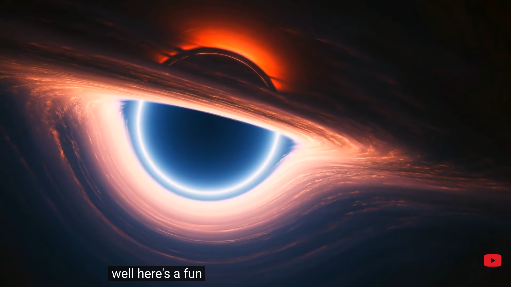
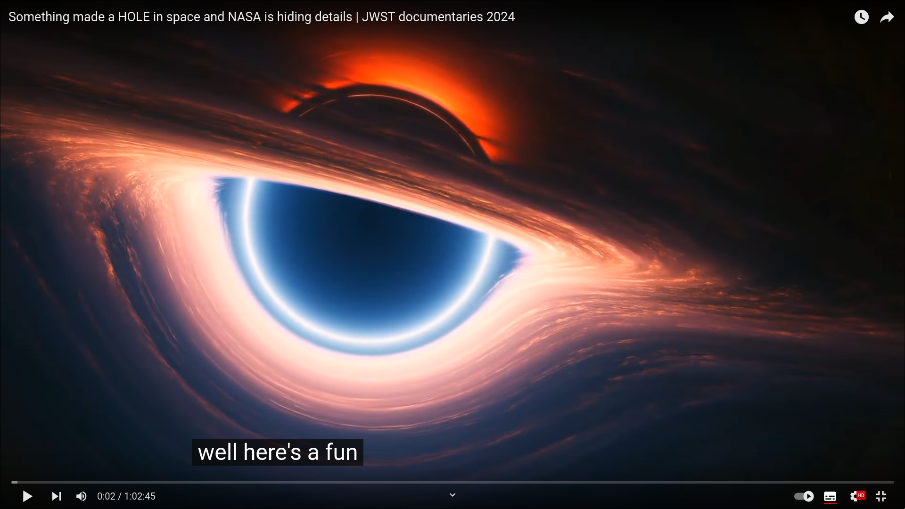

# YouTube Full Screen Enhancer

This script enhances the user experience when pausing a YouTube video in full-screen mode by hiding certain elements and adding a play icon.

## Features

- **Hide Video Title**: The video title is hidden when the video is paused in full-screen mode.
- **Hide Player Control Bar**: The player control bar is hidden when the video is paused in full-screen mode.

- **Stabilize Captions**: Prevents captions text from jumping up and down when you pause or resume the video using the spacebar or "K" key.

- **Add Play Icon**: A play icon is added at the bottom right corner of the video when paused.

## Screenshot

The first screenshot displays the enhanced full-screen mode with hidden interface elements, including the video title and player control bar. Additionally, an overlay of a play icon is added when the video is paused. In contrast, the second screenshot shows the default full-screen mode without the enhancements enabled.

- **With Enhancements Enabled**
  

- **Default (Without Enhancements)**
  

> The source of the video captured in the screenshots is: [https://www.youtube.com/watch?v=wFcOuJmgTno](https://www.youtube.com/watch?v=wFcOuJmgTno)

## Usage

To use this script, visit the [YouTube Full Screen Enhancer](https://greasyfork.org/en/scripts/460569) and install it using a user script manager like Tampermonkey. Once installed, the script will automatically run whenever you visit YouTube.

## Compatibility

This script is compatible with all modern browsers and works with the latest version of YouTube.

## Notes

- Make sure your browser supports user script manager extensions and that you have one installed before attempting to use this script.

- This script may need to be adjusted or updated in the future if YouTube's DOM structure or functionality changes.
